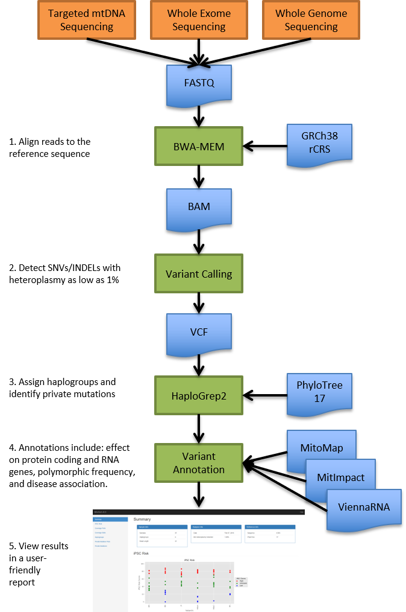

# MitoSort 
MitoSort is a comprehensive python package designed to rapidly perform mitochondrial (mtDNA) analysis of Next Generation Sequence (NGS) data. 



## Dependencies
 MitoSort supports Python 2.7.
Installation requires [samtools](http://samtools.sourceforge.net/), [bwa](http://bio-bwa.sourceforge.net/), [qsub]() and python packages [numpy](http://www.numpy.org/), [pandas](http://pandas.pydata.org/), [matplotlib](https://matplotlib.org/),  [pysam](http://pysam.readthedocs.io/en/latest/api.html), and [viennaRNA](https://www.tbi.univie.ac.at/RNA/).
## Installation

Prior to installation, you will need to have samtools, bwa, qsub, and viennaRNA installed.\n
To install:
```bash
git clone https://github.com/sjrowley8/MitoSort
```
Once installed:
```bash	
pip install -r requirements.txt
python build_config.py
```
This will check for any necessary python dependencies, install them, and build your configuration file.  
## Config.txt	
Once setup.py has successfully run, you will need to edit some additional information into your config.txt to run MitoSort on your cluster.  You will need to fill out the cluster parameters within this file, including QUEUE, MEMORY, and EMAIL.  

If any of the non-python dependencies are not installed, or if viennaRNA is not installed, you will need to manually write in the path to each dependency missing.

## Usage
Inputs can be in either FASTQ or BAM format from Whole Genome Sequencing (WGS), targeted mtDNA sequencing, or even some exome sequencing protocols that include mtDNA coverage. MitoSort can run on a single machine or optionally submit all samples in parallel on a Linux cluster.
```
EXAMPLE USAGE:
python MitoSort.py -s sample_info.txt -o /path/to/output_dir/

OPTIONS:
-s,--sample_info        A tab-separated text file defining sample information (required)
-o,--output             Full path to output directory (required)
-c,--config             Config file (required)
-p,--parallel           Parallel mode. Submits jobs to an SGE cluster using qsub. Default: False
-i,--ipsc               Add iPSC annotations. Default: False
-w,--wgs                Samples are from Whole Genome Sequencing. Default: False
-f,--pedigree           Pedigree file for family analysis.
-t,--somatic            Perform a Somatic analysis with Normal and Tumor samples. Default: False
-h,--help               help message

```
## References


1. Castellana, S., J. Ronai, et al. (2015). "MitImpact: an exhaustive collection of pre-computed pathogenicity predictions of human mitochondrial non-synonymous variants." Human mutation 36(2): E2413-2422.
2. Chu, H. T., W. W. Hsiao, et al. (2012). "Quantitative assessment of mitochondrial DNA copies from whole genome sequencing." BMC genomics 13 Suppl 7: S5.
3. Lorenz, R., S. H. Bernhart, et al. (2011). "ViennaRNA Package 2.0." Algorithms for molecular biology : AMB 6: 26.
4. Lott, M. T., J. N. Leipzig, et al. (2013). "mtDNA Variation and Analysis Using Mitomap and Mitomaster." Current protocols in bioinformatics 44: 1 23 21-26.
5. van Oven, M. and M. Kayser (2009). "Updated comprehensive phylogenetic tree of global human mitochondrial DNA variation." Human mutation 30(2): E386-394.
6. Weissensteiner, H., D. Pacher, et al. (2016). "HaploGrep 2: mitochondrial haplogroup classification in the era of high-throughput sequencing." Nucleic acids research 44(W1): W58-63.
7. Ye, K., J. Lu, et al. (2014). "Extensive pathogenicity of mitochondrial heteroplasmy in healthy human individuals." Proceedings of the National Academy of Sciences of the United States of America 111(29): 10654-10659.